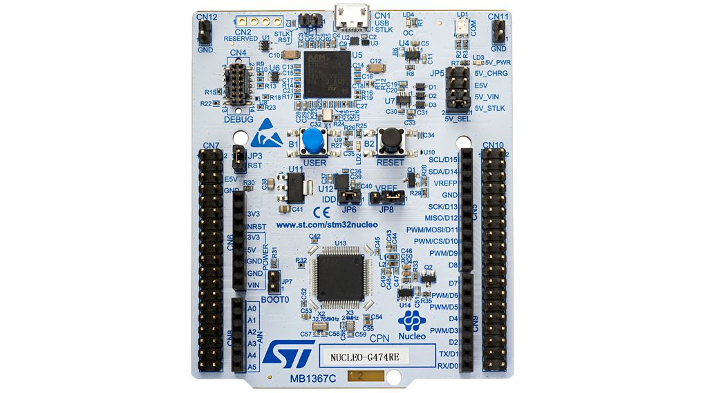

# Project of course "Laboratory of Architecture & Electronic System Programmation" of Electronic Engineeering degree
<!--
*** Thanks for checking out the Best-README-Template. If you have a suggestion
*** that would make this better, please fork the NuriCheat and create a pull request
*** or simply open an issue with the tag "enhancement".
*** Thanks again! Now go create something AMAZING! :D
***
***
***
*** To avoid retyping too much info. Do a search and replace for the following:
*** Stikinit, kf-eval, twitter_handle, email, project_title, project_description
-->


<!-- PROJECT SHIELDS -->
<!--
*** I'm using markdown "reference style" links for readability.
*** Reference links are enclosed in brackets [ ] instead of parentheses ( ).
*** See the bottom of this document for the declaration of the reference variables
*** for contributors-url, forks-url, etc. This is an optional, concise syntax you may use.
*** https://www.markdownguide.org/basic-syntax/#reference-style-links
-->
[![Contributors][contributors-shield]][contributors-url]
[![Stargazers][stars-shield]][stars-url]
[![Issues][issues-shield]][issues-url]
[![GitHub followers][github-shield]][github-url]


This exam project have to porpose to realize led game, in particular the led most near at the ground must light on and the others light off.


<!-- TABLE OF CONTENTS -->
<details open="open">
  <summary><h2 style="display: inline-block">Table of Contents</h2></summary>
  <ol>
    <li>
      <a href="#about-the-project">About The Project</a>
      <ul>
        <li><a href="#built-with">Built With</a></li>
      </ul>
    </li>
    <li>
      <a href="#getting-started">Getting Started</a>
      <ul>
        <li><a href="#prerequisites">Prerequisites</a></li>
        <li><a href="#installation">Installation</a></li>
      </ul>
    </li>
    <li><a href="#usage">Usage</a></li>
    <li><a href="#roadmap">Roadmap</a></li>
    <li><a href="#contributing">Contributing</a></li>
    <li><a href="#contact">Contact</a></li>
  </ol>
</details>


<!-- ABOUT THE PROJECT -->
## About The Project
This exam project have to porpose to realize led game, in particular the led most near at the ground must light on and the others light off.

### ST Micro:

<p align="center">
  
  
### Built With

* [STM CubeIDE](https://www.st.com/en/development-tools/stm32cubeide.html)

<!-- GETTING STARTED -->
## Getting Started

To get a local copy up and running follow these simple steps.

### Prerequisites
* Git
* STM CubeIDE
* STM Microcontroller

### Installation

1. Install Git at [Download Git](https://git-scm.com/download).
2. Clone the repo.
   ```sh
   git clone https://github.com/AndreaCastronovo/AppTrail
   ```
4. Install the latest version of STM Cube IDE.
5. Open the directory with STM Cube IDE.


<!-- USAGE EXAMPLES -->
## Usage

To use the application:
* Open app with STM Cube IDE
* Build and Run in microcontroller


<!-- ROADMAP -->
## Roadmap

See the [open issues](https://github.com/AppTrial/progetto-labarch/issues) for a list of proposed features (and known issues).

### Future developments


<!-- CONTRIBUTING -->
## Contributing

Contributions are what make the open source community such an amazing place to be learn, inspire, and create. Any contributions you make are **greatly appreciated**.

1. Fork the Project
2. Create your Feature Branch (`git checkout -b feature/AmazingFeature`)
3. Commit your Changes (`git commit -m 'Add some AmazingFeature'`)
4. Push to the Branch (`git push origin feature/AmazingFeature`)
5. Open a Pull Request


<!-- CONTACT -->
## Contact

Andrea Castronovo     - andrea.castronovo98@gmail.com <br>
Andrea Manfroni       - andrea.manfroni@studio.unibo.it <br>
Andrea Dario          -
Alex   Chiacchiaretta -

Project Link: [https://github.com/AppTrial/progetto-labarch](https://github.com/AppTrial/progetto-labarch)


<!-- MARKDOWN LINKS & IMAGES -->
<!-- https://www.markdownguide.org/basic-syntax/#reference-style-links -->
[contributors-shield]: https://img.shields.io/github/contributors/AppTrial/progetto-labarch.svg?style=for-the-badge
[contributors-url]: https://github.com/AppTrial/progetto-labarch/graphs/contributors
[stars-shield]: https://img.shields.io/github/stars/AppTrial/progetto-labarch.svg?style=for-the-badge
[stars-url]: https://github.com/AppTrial/progetto-labarch/stargazers
[issues-shield]: https://img.shields.io/github/issues/AppTrial/progetto-labarch.svg?style=for-the-badge
[issues-url]: https://github.com/AppTrial/progetto-labarch/issues
[github-shield]: https://img.shields.io/github/followers/AndreaCastronovo.svg?style=social&label=Follow
[github-url]: https://github.com/AndreaCastronovo
